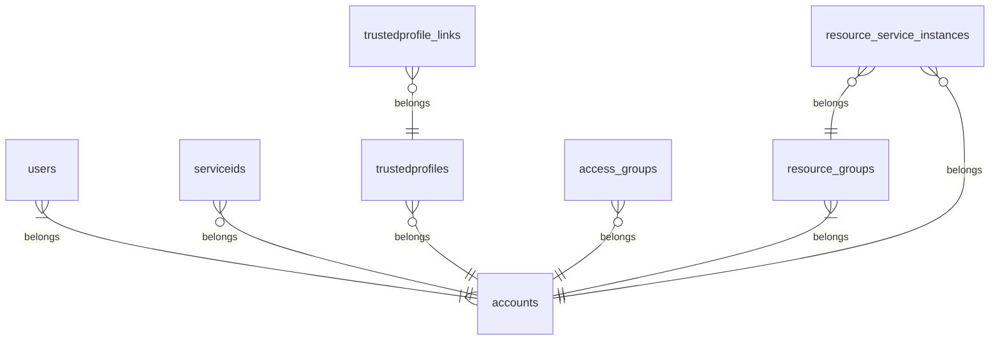

# IBM Cloud access management analytics

IBM Cloud offers APIs to retrieve identity and access management data. We show how to analyze it to improve your cloud security setup.

If you have worked with IBM Cloud and looked into security and compliance, you might have already used all the following information sources to improve account security:
- Activity data logged to [Activity Tracker](https://cloud.ibm.com/observe/activitytracker)
- Runtime logs found in [Log Analysis](https://cloud.ibm.com/observe/logging)
- Security posture analysis performed by the [IBM Cloud Security and Compliance Center](https://cloud.ibm.com/security-compliance/compliance-posture)
- IAM reports on [inactive identities](https://cloud.ibm.com/iam/inactive-identities) and [inactive policies](https://cloud.ibm.com/iam/inactive-policies)


### Build the database

When [logged in to IBM Cloud on the command line](https://cloud.ibm.com/docs/cli?topic=cli-ibmcloud_cli#ibmcloud_login), [obtain an IAM access token](https://cloud.ibm.com/docs/cli?topic=cli-ibmcloud_commands_iam#ibmcloud_iam_oauth_tokens) (bearer token). Thereafter, run the script to build the database with access management data:

```
export IBMCLOUD_TOKEN=$(ibmcloud iam oauth-tokens --output json | jq -r '\''.iam_token'\'')
python database.py
```

It builds a SQLite database and stores it in the file **iaminsights.sqlite3**. 


#### Entity-Relationship Diagram:




### Run the reports

```
python reports.py
```


## Contribute
If you have an interesting query to share or improvements to add, please feel free to open a pull request. 