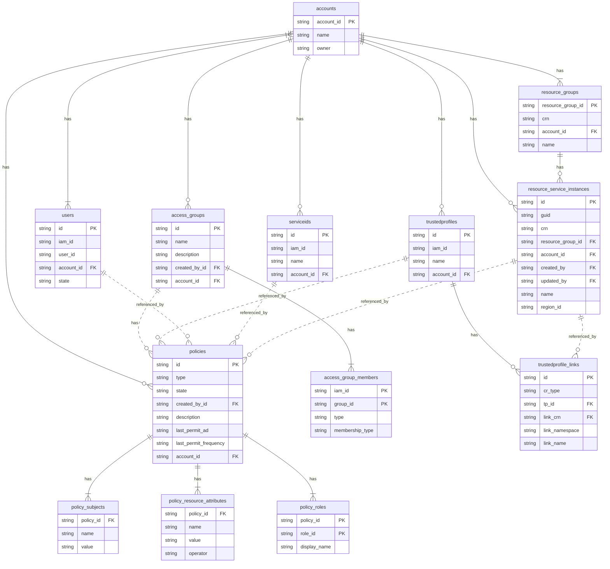

# IBM Cloud access management analytics

IBM Cloud offers APIs to retrieve identity and access management data. We show how to analyze it to improve your cloud security setup.

If you have worked with IBM Cloud and looked into security and compliance, you might have already used all the following information sources to improve account security:
- Activity data logged to [Activity Tracker](https://cloud.ibm.com/observe/activitytracker)
- Runtime logs found in [Log Analysis](https://cloud.ibm.com/observe/logging)
- Security posture analysis performed by the [IBM Cloud Security and Compliance Center](https://cloud.ibm.com/security-compliance/compliance-posture)
- IAM reports on [inactive identities](https://cloud.ibm.com/iam/inactive-identities) and [inactive policies](https://cloud.ibm.com/iam/inactive-policies)


### Build the database

When [logged in to IBM Cloud on the command line](https://cloud.ibm.com/docs/cli?topic=cli-ibmcloud_cli#ibmcloud_login), [obtain an IAM access token](https://cloud.ibm.com/docs/cli?topic=cli-ibmcloud_commands_iam#ibmcloud_iam_oauth_tokens) (bearer token). Thereafter, run the script to build the database with access management data:

```
export IBMCLOUD_TOKEN=$(ibmcloud iam oauth-tokens --output json | jq -r '\''.iam_token'\'')
python database.py
```

It builds a SQLite database and stores it in the file **iaminsights.sqlite3**. The same database file is later used by the reporting script.

To rebuild the database, delete the database file, then run the above commands again.

#### Entity-Relationship Diagram:
A simplified view on the access management data, based on the tables defined in [utils/CloudTables.py](utils/CloudTables.py):




### Run the reports
To obtain the configured reports, simply run the following command:

```
python reports.py
```

The following shows sample output from one of the included reports:


To modify which reports are run, change [reports.py](reports.py). The queries itself are defined in the file [utils/reports.py](utils/reports.py). You can add your own queries to the array of query objects. Each query is a JSON object consisting of a name, statement, and a description.

### Ideas for enhancements
Some ideas on how to enhance the existing scripting:
- Integrate the **database.py** and **reports.py** scripts and add parameters to pick the actions
- Use an in-memory database which does not persist the data.
- Partial refresh of data. Only update from specified APIs instead of rebuilding everything.

## Contribute
If you have an interesting query to share or improvements to add, please feel free to open a pull request. 